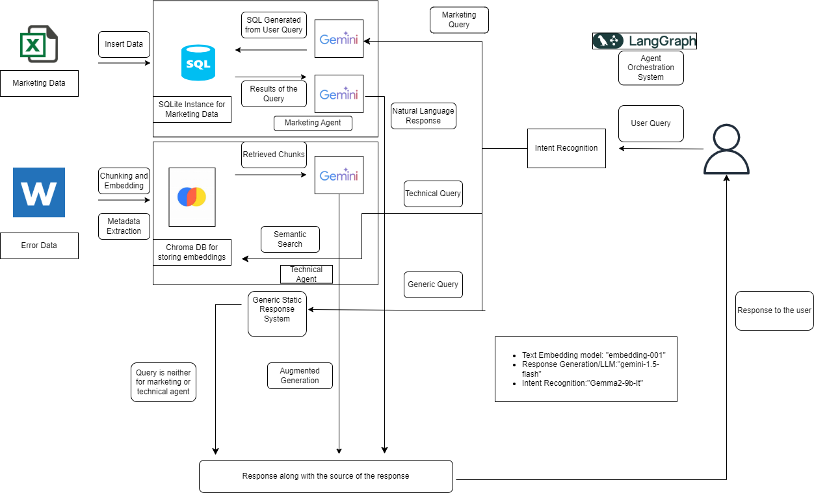

# 📞 Multi-Agent LLM-Based Customer Service System for Telecom Firm

## Overview

This project presents a modular, multi-agent system powered by large language models (LLMs), designed to enhance customer service capabilities at **TeleCorp Firm**. The system integrates multiple intelligent agents for handling diverse query types and provides a seamless, conversational interface to both customers and support staff.

The system is divided into three major components:

1. **Marketing Data Agent**  
2. **Technical Support Agent**  
3. **Intent Recognition & Agent Orchestration**

---

## 🧭 Architecture Overview

## 🧠 Implementation Plan

### 1. Marketing Data Agent

This agent answers data-driven marketing queries by converting natural language questions into SQL and returning insightful, human-readable responses.

#### Steps:

1. Generated a **data dictionary** using ChatGPT based on the database schema to provide column-level context.
2. Loaded CSV data into a **local SQLite database** using the defined schema.
3. Created a **prompt template** that includes schema, column descriptions, and user input to guide SQL generation.
4. Used **Gemini 1.5 Flash** to convert user questions into SQL queries.
5. Cleaned up the generated SQL to remove unwanted artifacts and executed it against the database.
6. Passed the **SQL result and original query** back to the LLM to generate a natural language answer.
7. Implemented **error handling** using `try-catch`:
   - If the SQL query fails, the LLM responds with an initial analysis or follow-up question.

---

### 2. Technical Support Agent

This agent uses document-based retrieval to answer queries related to technical issues and error documentation.

#### Steps:

1. Converted the provided `.doc` file to `.pdf` and uploaded it to a designated folder.
2. Designed the system to **support multiple files** within that folder.
3. Parsed and **chunked each document**, storing metadata like page number and filename.
4. Embedded the chunks using the `text-embedding-001` model and stored them in **ChromaDB**.
5. On receiving a user query:
   - Performed **similarity search** on the vector database to retrieve relevant chunks.
   - Used a **prompt template** to include retrieved content, the user query, system context, and chat history.
   - Sent this to the LLM and returned both the **answer and source document info** to the user.

---

### 3. Intent Recognition & Agent Orchestration

This component routes user queries to the correct agent (marketing or technical) based on detected intent.

#### Steps:

1. Defined and registered all agents in the orchestration framework.
2. Built a **GraphState** object to track question, response, source, and conversation state.
3. Implemented a **router function** using Groq and custom prompts to differentiate between marketing and technical queries.
4. Created four functions:
   - Marketing Agent
   - Technical Agent
   - Router Function
   - Generic Fallback Agent (for unmatched queries)
5. Defined each agent as a node, set **conditional edges**, and configured a final node.
6. Compiled the agent workflow and triggered it with sample user questions.

---

## 🔧 Technologies Used

- **LLMs**: Gemini 1.5 Flash, OpenAI
- **Embeddings**: `text-embedding-001`
- **Vector Store**: ChromaDB
- **Database**: SQLite (local)
- **Orchestration & Workflow**: Groq, LangGraph (assumed)
- **Languages**: Python (assumed)

---

